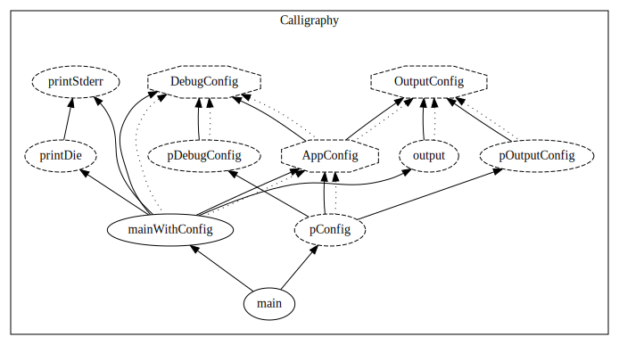

# calligraphy
[](http://hackage.haskell.org/package/calligraphy)
[](https://stackage.org/nightly/package/calligraphy)



`calligraphy` is a Haskell call graph/source code visualizer.

It works directly on GHC-generated HIE files, giving us features that would otherwise be tricky, like type information and support for generated files.
`calligraphy` has been tested with all versions of GHC that can produce HIE files (i.e. GHC 8.8, 8.10, 9.0, and 9.2.)

See [the accompanying blog post](https://jonascarpay.com/posts/2022-04-01-salt.html) for more examples, and an extended tutorial.

## Usage

1. Install `calligraphy` through your Haskell package manager.
Since it uses HIE files, it usually needs to be compiled with the same version of GHC as your project.

2. Install [GraphViz](https://graphviz.org/). By default, `calligraphy` needs `dot` to be available in the search path.

3. Generate HIE files for your project by passing the `-fwrite-ide-info` to GHC.
If you're using Cabal, for example, you'd invoke `cabal new-build --ghc-options=-fwrite-ide-info`

4. Run `calligraphy`.
You probably want to start by running `calligraphy --help` to see what options it supports, but as an example, the above graph was produced using the following command:
```
calligraphy Calligraphy --output-png out.png --collapse-data
```
Where `Calligraphy` in this case is the name of the module.

## Philosophy

Writing and especially maintaining Haskell tooling is really hard.
Haskell, let alone GHC, is underspecified, overcomplicated, and constantly changing.
If you don't have a strategy for dealing with this, reality eventually catches up with you; there is an abundance of abandoned projects (think formatters, linters, editor plugins, IDEs, etc.)
So too it is with `calligraphy`.
Working with HIE files instead of Haskell source files allows us to leverage GHC for parsing and type checking, which is nice, but HIE files themselves are nothing but untyped views into GHC's eldritch heart, and come with their own threats to sanity.
So, how _do_ we deal with this?

Put simply, the goal of `calligraphy` is not to be accurate, but to be as simple as possible while still being useful.
If we can get 80% accuracy for 20% of the effort, that's great, and if we can get 64% accuracy for 4% effort, that's even better.
That necessarily means that **`calligraphy` will sometimes be wrong.**
When this happens, please open a bug report (especially if it's egregious), but know that there's a chance it's simply not worth fixing.

Here's an example.
The type-related logic is currently ~15 lines.
It works by, for every identifier, walking the type HIE gives us for that identifier, and adding an edge to every identifier it references.
This works perfectly in 95% of cases, but field accessors will, _only on GHC 9.2_ and _only sometimes_, not get the type of their parent data type.
That's annoying, but we have to draw a line somewhere, and `calligraphy` always errs towards simplicity and maintainability.
We _could_ try to figure out and fix this as a special case, or try to use information from type signatures to fix it in general, but for this project the 15 lines is more important than the 95%.
As another example, supporting for graphing Template Haskell-generated code would be a great feature, and it seems like it'd be easy to implement since HIE files are generated _after_ TH expansion.
Unfortunately however, the way TH code appears in the HIE output breaks many heuristics that we currently use to structure the source graph, so for now I decided that unless there's an elegant way to naturally incorporate it, it's not worth it.

That doesn't mean that we don't care about accuracy at all.
The test suite contains a baseline reference module, and makes sure that `calligraphy` generates the same correct graph for it across GHC versions.
Finding a simple, maintainable, and robust set of heuristics that passes the test suite and never face plants on edge cases, took months, a lot of failed attempts, and a hefty dose of sunk cost fallacy.
Furthermore, there's almost certainly still ways to make it simpler and more general.
I'm very open to questions and suggestions on how to do this, especially if you have experience with GHC/HIE files.
